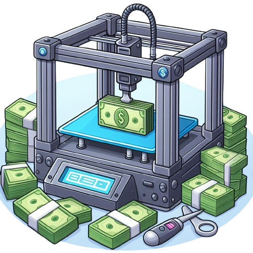

    

  # **3d Print Calculator for PLA**

## Short description
This project is to help people with calculating how much their, plastic filament, 3D model is worth. This project is still under development but this project is still functional and works as intended, as long as you correctly answer the prompts provided.

## Status of project:
This project is currently still under development for the front-end portion. The back-end of the project should work as functionally intended for both Python and Javascript version. While the front-end portion is in development, if there is any issues with the code, please let me know.

## **How to calculate the prices.**
- ### **Deprecation cost:**
    - **First**, we would need to calculate the time spent printing the item to a decimal.
        - Formula: **print_hours + print_minutes / 60**
        - Explanation: You will divide how many minutes it would take to print by 60 and add the amount of hours that it would take to print to it. This will help to calculate the amount of time it will take to print this product to a decimal for the calculation below. The hours will be shown as the whole number and with the minutes being divided by 60, this will make the decimal of the minute. More info about this below.
    - **Second**, we can use the result of the formula above to calculate the deprecation cost.
        - Formula: **(machine_cost / machine_hours) + print_time**
        - Explanation: We would want to divide how much the machine costs by the amount of hours the machine has (most printers has a 20,000 hour life span). After getting the result of that, you would want to take the solution from the first formula and add it to the result to get your deprecation cost. This is to help calculate the cost for using your machine and the cost of wear and tear for the print.
- ### **Filament cost:**
    - Formula: **(price_per_kg / 1000) * model_weight**
    - Explanation: We would divide the price of the kg of a roll of filament by 1000mgs. Also multiply the models weight in grams to the result. This will calculate the cost of the amount of filament required to make the model.
- ### **Other costs:**
    - Formula: **hourly_rate * print_time**
    - Explanation: We would multiply the hourly rate by the print time to get the cost of electricity, personal time usage, etc. I typically do $5 as a hourly_rate.
- ### **Base price:**
    - Formula: **deprecation_cost + filament_cost + other_costs**
    - Explanation: We would want to add the deprecation cost to the filament cost and other costs total together to get the base cost of the model before the profit cost.
- ### **Profit total:**
    - Formula: **base_price * profit_percentage**
    - Explanation: We would want to take the base price's total and multiply it by the profit percentage we want to be able to make a profit as well for creating the model. Profit percentages for 3D models range around 40% - 80% profit (I do 60% for my prints) and this formula will calculate the percent of the project. Remember, when using a percentage in math, you need to put it as a decimal. example: 40% = 0.4, 64% = 0.64.
- ### **Actual price:**
    - Formula: **base_price + profit**
    - Explanation: We will add the pase price to the profit total that we got in the last formula to calculate the total of the model.